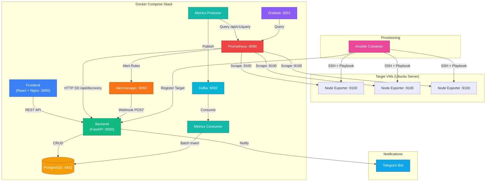
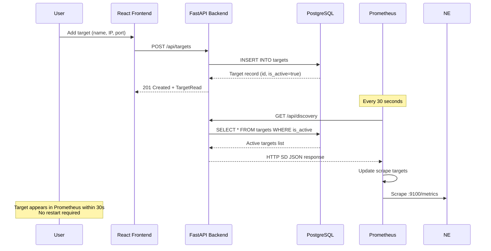
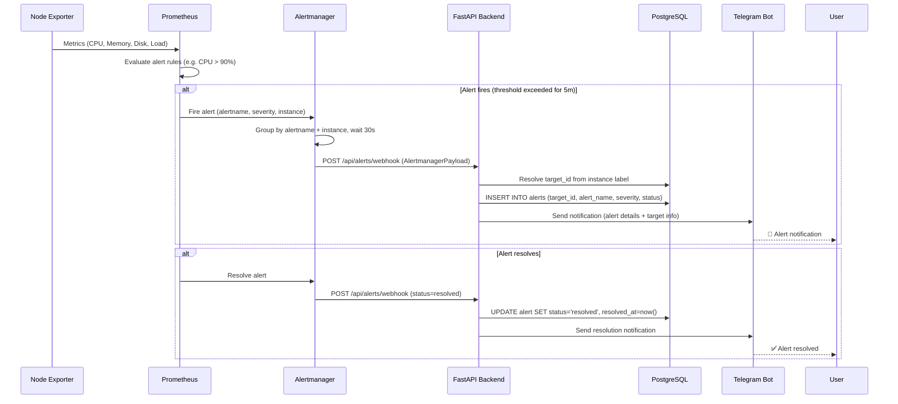
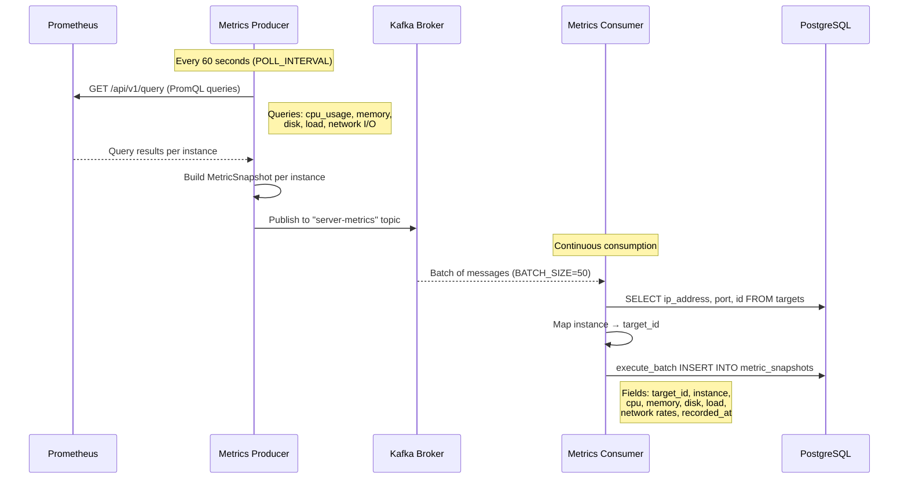
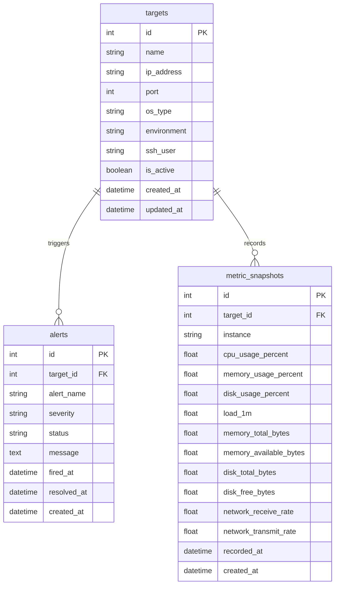

# Architecture

> **Platform**: Plateforme de Monitoring Multi-VMs pour le Suivi de Métriques Système en Temps Réel
> **Version**: 2.0 — Upgraded from [Monitoring-Stack-with-Grafana](https://github.com/Yussf101/Monitoring-Stack-with-Grafana)

## System Overview



## Component Reference

| Service | Technology | Container | Port | Responsibility |
|---|---|---|---|---|
| **Backend** | Python FastAPI | `monitoring-backend` | 8000 | REST API for target CRUD, Prometheus HTTP SD, alert webhook, and metrics queries |
| **Frontend** | React + Vite + Nginx | `monitoring-frontend` | 3000 | Admin dashboard for target management and alert history viewing |
| **Database** | PostgreSQL 15 | `monitoring-db` | 5432 | Persistent storage for targets, alerts, and metric snapshots |
| **Prometheus** | Prometheus v2.53.0 | `monitoring-prometheus` | 9090 | Metric scraping, alert rule evaluation, time-series storage (15d retention) |
| **Alertmanager** | Alertmanager v0.27.0 | `monitoring-alertmanager` | 9093 | Alert grouping, deduplication, and routing to webhook receiver |
| **Kafka** | Apache Kafka (KRaft) | `monitoring-kafka` | 9092 | Message broker for `server-metrics` topic |
| **Metrics Producer** | Python (kafka-python) | `monitoring-metrics-producer` | — | Polls Prometheus API every 60s, publishes metric snapshots to Kafka |
| **Metrics Consumer** | Python (kafka-python + psycopg2) | `monitoring-metrics-consumer` | — | Batch-consumes from Kafka, resolves target IDs, inserts into PostgreSQL |
| **Grafana** | Grafana (latest) | `monitoring-grafana` | 3001 | Interactive metric visualization dashboards sourced from Prometheus |
| **Ansible** | Ansible (on-demand) | `monitoring-ansible` | — | Provisions Node Exporter on target VMs and registers them via the API |

## Data Flow: Target Management

This sequence shows how a new VM target is registered and becomes automatically monitored.



## Data Flow: Alerting Pipeline

This sequence shows the end-to-end alert lifecycle from metric threshold violation to Telegram notification.



## Data Flow: Metrics Pipeline (Kafka)

This sequence shows how system metrics flow from Prometheus through Kafka into PostgreSQL for historical storage.



## Database Schema



## Directory Structure

```
monitoring-platform-v2/
├── backend/                    # FastAPI control plane
│   ├── app/
│   │   ├── core/               # Config, database, settings
│   │   ├── models/             # SQLAlchemy ORM models (Target, Alert, MetricSnapshot)
│   │   ├── routers/            # API endpoint handlers (targets, alerts, discovery, metrics)
│   │   ├── schemas/            # Pydantic request/response schemas
│   │   ├── services/           # Business logic layer
│   │   └── main.py             # FastAPI app initialization
│   ├── alembic/                # Database migrations
│   ├── tests/                  # pytest test suite
│   ├── Dockerfile
│   └── requirements.txt
├── frontend/                   # React admin dashboard
│   ├── src/
│   │   ├── components/         # UI components (Sidebar, TargetTable, AlertTable, etc.)
│   │   ├── pages/              # Page components (Dashboard, Targets, Alerts)
│   │   ├── lib/                # API client and utilities
│   │   └── App.tsx             # Root component with routing
│   ├── Dockerfile              # Multi-stage build → Nginx
│   └── nginx.conf              # Reverse proxy to backend API
├── pipeline/                   # Kafka data pipeline
│   ├── producer.py             # Polls Prometheus, publishes to Kafka
│   ├── consumer.py             # Consumes from Kafka, writes to PostgreSQL
│   └── Dockerfile
├── prometheus/                 # Prometheus configuration
│   ├── prometheus.yml          # Scrape config with http_sd_configs
│   └── alerts/                 # Alert rule definitions (node_alerts.yml)
├── alertmanager/               # Alertmanager configuration
│   └── alertmanager.yml        # Routes alerts to backend webhook
├── grafana/                    # Grafana configuration
│   ├── grafana.ini             # Server settings
│   └── provisioning/           # Auto-provisioned datasources and dashboards
├── ansible/                    # Infrastructure automation
│   ├── site.yml                # Main playbook
│   ├── roles/                  # Ansible roles (node_exporter, register_target)
│   ├── inventory/              # Host inventory files
│   └── Dockerfile              # Containerized Ansible runner
├── .github/workflows/          # CI/CD
│   └── ci.yml                  # Lint, test, build, push Docker images
├── docker-compose.yml          # Full stack orchestration (10 services)
└── .env                        # Environment variables (not committed)
```

## Key Design Decisions

| Decision | Choice | Rationale |
|---|---|---|
| **Service Discovery** | Prometheus HTTP SD (`http_sd_configs`) | Zero-downtime target management — no Prometheus restarts needed |
| **Message Broker** | Apache Kafka (KRaft mode) | Decouples metric collection from storage; enables replay and buffering |
| **Alert Delivery** | Alertmanager → Webhook → Telegram | Leverages Prometheus ecosystem; webhook allows persistence + custom routing |
| **Database** | PostgreSQL (async via asyncpg) | ACID compliance for target/alert state; async driver for non-blocking I/O |
| **Frontend Serving** | Nginx (production build) | Static asset serving + API reverse proxy in a single container |
| **IaC** | Containerized Ansible | Reproducible provisioning without installing Ansible on the host |
| **CI/CD** | GitHub Actions → GHCR | Native GitHub integration; free for public repos |
