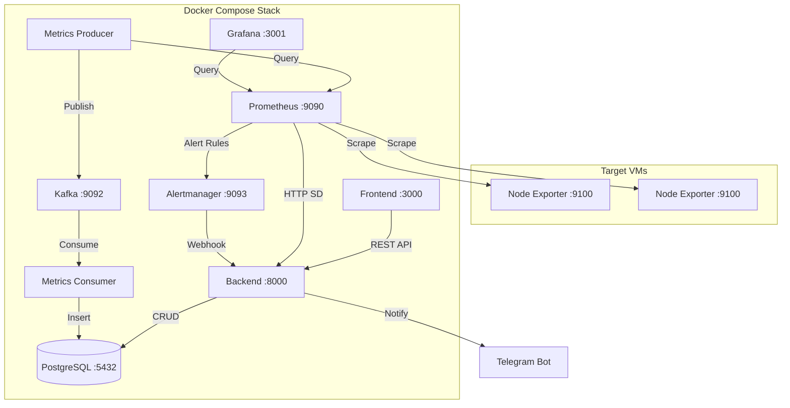

# Multi-VM Monitoring Platform

> Real-time system metrics monitoring platform

[](https://github.com/Yussf101/monitoring-platform/actions/workflows/ci.yml)
[](https://docs.docker.com/compose/)
[](https://www.python.org/)
[](https://react.dev/)

[](https://github.com/topics/monitoring)
[](https://github.com/topics/observability)
[](https://github.com/topics/prometheus)
[](https://github.com/topics/fastapi)
[](https://github.com/topics/kafka)
[](https://github.com/topics/ansible)
[](https://github.com/topics/grafana)

---

## Overview

A monitoring and observability platform built as a 2nd year (2A) PFA project at INSEA (Data & Software Engineering) in partnership with Orange Maroc. It replaces a [previous manual monitoring stack](https://github.com/Yussf101/Monitoring-Stack-with-Grafana) with an automated, API-driven solution.

## Features

- **Target Management**: Add or remove monitored VMs via a REST API. Prometheus updates its targets automatically via HTTP Service Discovery without restarting.
- **Data Pipeline**: Metrics are routed from Prometheus through Apache Kafka into PostgreSQL for long-term storage and analysis.
- **Alerting**: Configured Prometheus alert rules trigger notifications via Alertmanager, which are sent to a Telegram Bot via a FastAPI webhook.
- **Admin Dashboard**: A React-based web interface to manage target inventory and view alert history, alongside Grafana for metric visualization.
- **Infrastructure Automation**: An Ansible playbook to deploy Node Exporter on target Linux VMs.

## Tech Stack

- **Backend**: Python, FastAPI
- **Frontend**: React, Vite, shadcn/ui
- **Database**: PostgreSQL 15
- **Message Broker**: Apache Kafka (KRaft mode)
- **Metrics & Alerting**: Prometheus, Node Exporter, Alertmanager, Grafana
- **Automation**: Ansible
- **Deployment**: Docker Compose

## Architecture

The project runs as a multi-container Docker Compose application.



*See [ARCHITECTURE.md](ARCHITECTURE.md) for detailed data flow diagrams and database schemas.*

## Getting Started

### Prerequisites
- Docker and Docker Compose (v2+)
- Linux VMs as the targets to be monitored
- (Optional) Telegram Bot Token (from [@BotFather](https://t.me/BotFather))

### Installation

1. Clone the repository:
   ```bash
   git clone https://github.com/Yussf101/monitoring-platform.git
   cd monitoring-platform
   ```

2. Set up environment variables:
   ```bash
   cp .env.example .env
   # Edit .env with your configuration, mainly PostgreSQL credentials (user, password...)
   ```

3. Start the services:
   ```bash
   docker compose up -d
   ```

4. The services will be available at:
   - Frontend UI: http://localhost:3000
   - Backend API Docs: http://localhost:8000/docs
   - Prometheus: http://localhost:9090
   - Grafana: http://localhost:3001
   - Alertmanager: http://localhost:9093

### Provisioning Targets 

*(Note: You can skip this step if Node Exporter is already installed and running on your target VMs, just add them in the Admin Dashboard to be monitored)*

To automatically install Node Exporter on your target VMs (whose information you have added via the Admin Dashboard):
```bash
docker compose run --rm ansible
```

## Environment Variables

| Variable | Required | Description |
|---|---|---|
| `POSTGRES_USER` | Yes | PostgreSQL username |
| `POSTGRES_PASSWORD` | Yes | PostgreSQL password |
| `POSTGRES_DB` | Yes | PostgreSQL database name |
| `DATABASE_URL` | Yes | Async connection string (`postgresql+asyncpg://user:pass@db:5432/dbname`) |
| `BACKEND_PORT` | Yes | FastAPI server port (default: `8000`) |
| `TELEGRAM_BOT_TOKEN` | No | Telegram Bot API token for alerts |
| `TELEGRAM_CHAT_ID` | No | Telegram chat ID for alerts |
| `KAFKA_BOOTSTRAP_SERVERS` | Yes | Kafka broker address (default: `kafka:9092`) |

## Project Structure

```text
monitoring-platform-v2/
├── backend/                 # FastAPI server
├── frontend/                # React dashboard
├── pipeline/                # Kafka producer and consumer
├── prometheus/              # Prometheus configuration
├── alertmanager/            # Alertmanager configuration
├── grafana/                 # Grafana dashboards
├── ansible/                 # Node Exporter provisioning
monitoring-platform-v2/
├── backend/                 # FastAPI server
├── frontend/                # React dashboard
├── pipeline/                # Kafka producer and consumer
├── prometheus/              # Prometheus configuration
├── alertmanager/            # Alertmanager configuration
├── grafana/                 # Grafana dashboards
├── ansible/                 # Node Exporter provisioning
├── API.md                   # API endpoint reference
├── ARCHITECTURE.md          # System architecture + diagrams
└── docker-compose.yml       # Stack definition

```

## API Reference

Interactive API documentation is available at `/docs` when running the backend. A complete endpoint reference with request/response schemas can be found in [API.md](API.md).

Main endpoints:
- `GET /api/targets` - List monitoring targets
- `POST /api/targets` - Register a new target
- `GET /api/discovery` - Prometheus HTTP SD endpoint
- `GET /api/alerts` - List alert history
- `GET /api/metrics/latest` - Latest metrics per target

## Documentation

- [Architecture & Design](ARCHITECTURE.md)
- [API Reference](API.md)
